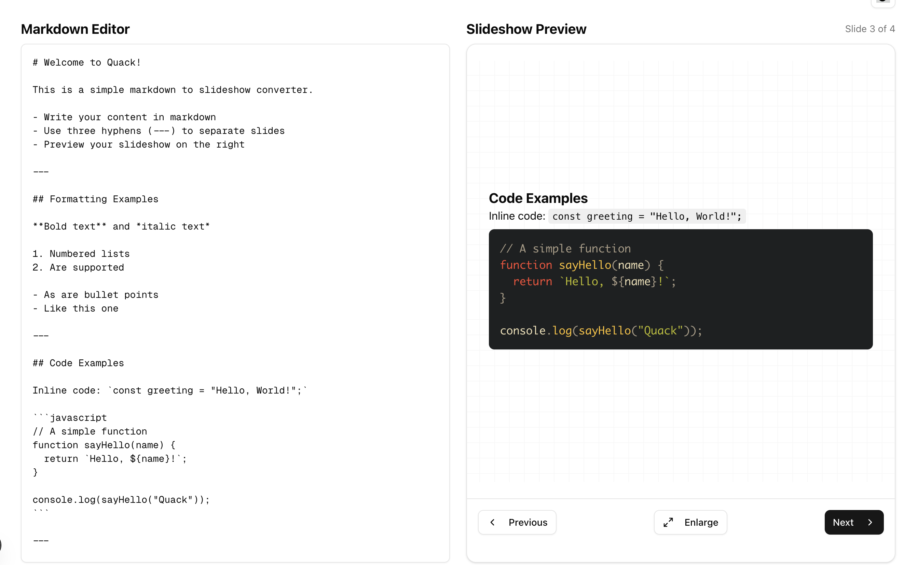

# Quack - Markdown Slideshow Creator

Quack is a simple, elegant web application that converts markdown into interactive slideshows. Perfect for developers, technical presenters, and anyone who prefers writing in markdown over using traditional presentation software.



## Features

- **Write in Markdown**: Create presentations using familiar markdown syntax
- **Live Preview**: See your slides as you type
- **Syntax Highlighting**: Beautiful code highlighting for technical presentations
- **Keyboard Navigation**: Navigate slides with arrow keys
- **Fullscreen Mode**: Present your slides in fullscreen
- **Dark/Light Theme**: Switch between themes for different environments
- **Responsive Design**: Works on desktop and mobile devices

## How It Works

1. Write your content in markdown in the editor
2. Separate slides with three hyphens (`---`) on a new line
3. Preview your slideshow in real-time
4. Present in fullscreen mode when ready

## Markdown Tips

- Use `#` for slide titles and `##` for subtitles
- Create lists with `-` or `1.` for numbered lists
- Format text with **bold** and _italic_
- Add code blocks with triple backticks and language name:
  ```javascript
  console.log("Hello, Quack!");
  ```

## Using with AI

You can use the following prompt with your favorite LLM to generate slide content:

```
Create a slideshow presentation about [your topic] using markdown formatting. Separate each slide with three hyphens (---). Include:

1. A title slide
2. 2-5 content slides with bullet points or numbered lists
3. A closing slide

Make the presentation about [your topic]. Use markdown features like:
- Headers (# for titles)
- Lists (- or 1. for bullets)
- **Bold** and *italic* text
- Code blocks with syntax highlighting
- > Blockquotes if relevant

Keep each slide focused and concise.
```

## Development

### Prerequisites

- Node.js (v16+)
- npm or yarn

### Installation

```bash
# Clone the repository
git clone https://github.com/JackAlexRose/quack.git
cd quack

# Install dependencies
npm install
# or
yarn install

# Start the development server
npm run dev
# or
yarn dev
```

### Building for Production

```bash
npm run build
# or
yarn build
```

## Technologies Used

- [Next.js](https://nextjs.org/) - React framework
- [Tailwind CSS](https://tailwindcss.com/) - Utility-first CSS framework
- [shadcn/ui](https://ui.shadcn.com/) - UI components
- [React Markdown](https://github.com/remarkjs/react-markdown) - Markdown rendering
- [Motion](https://motion.dev/) - Animation library

## License

This project is licensed under the MIT License - see LICENSE file for details.

## Contributing

Contributions are welcome! Please feel free to submit a Pull Request.

1. Fork the repository
2. Create your feature branch (`git checkout -b feature/amazing-feature`)
3. Commit your changes (`git commit -m 'Add some amazing feature'`)
4. Push to the branch (`git push origin feature/amazing-feature`)
5. Open a Pull Request

## Acknowledgments

- Inspired by the need for simple, developer-friendly presentation tools
- Thanks to all the open-source libraries that made this project possible
